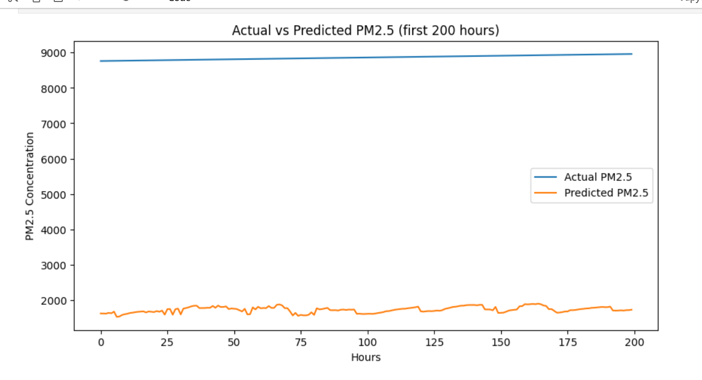
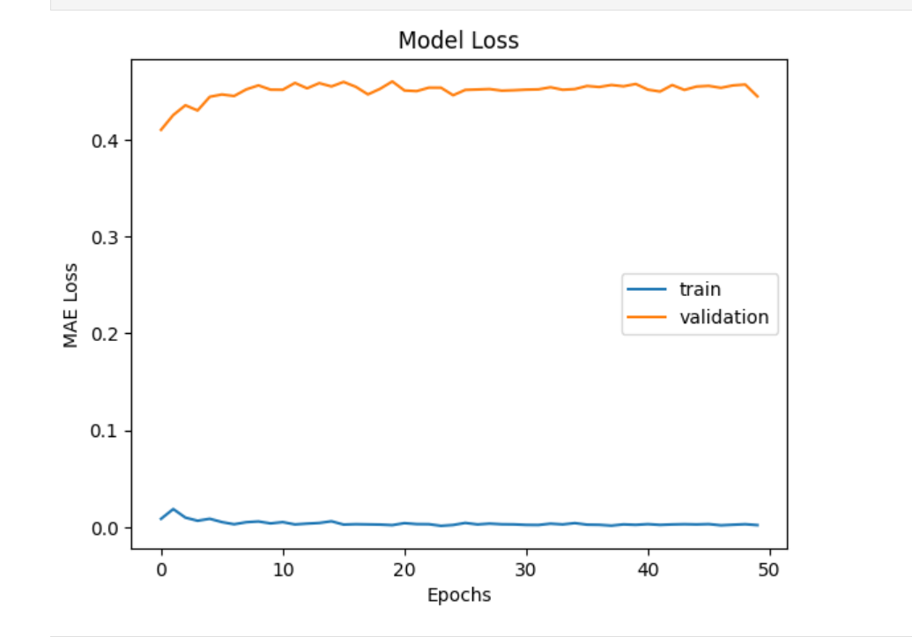

# LSTM Air Pollution Forecasting

## 📌 Overview
This project demonstrates **Air Pollution Forecasting using LSTM (Long Short-Term Memory) networks**.  
The dataset used is the **Beijing PM2.5 dataset** which contains air quality and meteorological data.  
The goal is to forecast future pollution levels based on historical trends.

## ⚙️ Project Workflow
- Data Preprocessing (handling missing values, scaling, and feature selection)
- Exploratory Data Analysis (EDA) with visualizations
- Building and training the LSTM model
- Model Evaluation
- Visualization of results

## 📊 Results
### Prediction vs Actual


### Loss Curve


## 🛠️ Tech Stack
- Python
- Jupyter Notebook
- TensorFlow / Keras
- Pandas, NumPy
- Matplotlib, Seaborn
- Scikit-learn

## 🚀 How to Run
1. Clone the repository  
   ```bash
   git clone https://github.com/Rahemath13/-LSTM-Air-Pollution-Forecasting.git
   cd -LSTM-Air-Pollution-Forecasting
